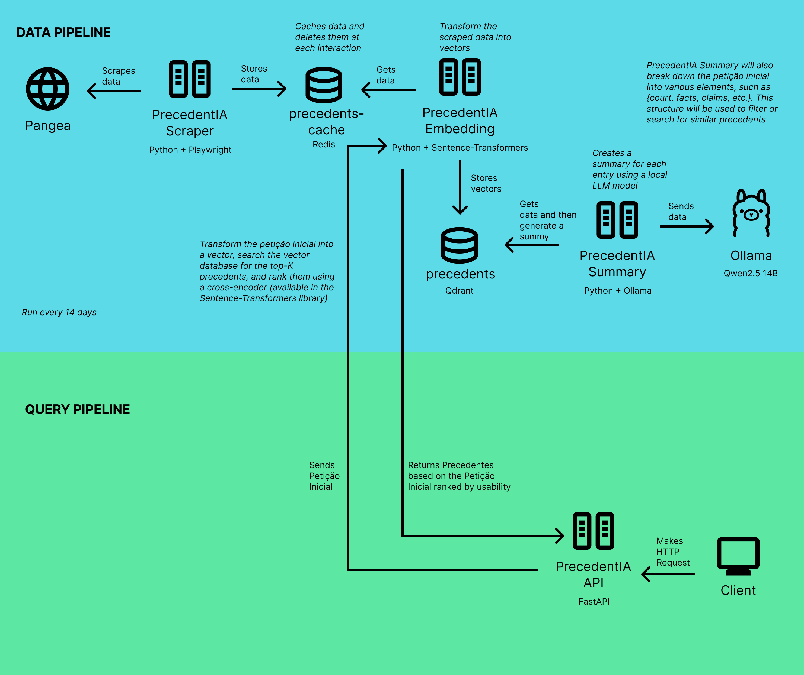

  

# ⚖️ PrecedentIA - Inteligência Artificial Jurídica

## Índice

- [📝 Descrição do Projeto](#-descrição-do-projeto)
- [📋 Product Backlog](#-product-backlog)
- [📅 Cronograma](#-cronograma)
- [🏗️ Estrutura do Projeto e Arquitetura](#️-estrutura-do-projeto-e-arquitetura)
- [⚙️ Tecnologias Utilizadas](#️-tecnologias-utilizadas)
- [🚀 Como executar e usar o projeto](#-como-executar-e-usar-o-projeto)
- [📂 Documentação](#-documentação)
- [👥 Equipe](#-equipe)

---

## 📝 Descrição do Projeto
A **Xertica.ai** identificou uma saturação nos fluxos de trabalho jurídicos na América Latina. Magistrados enfrentam uma carga processual elevada, onde a busca manual por precedentes em petições iniciais consome um tempo precioso que poderia ser dedicado à análise de mérito. 

O **PrecedentIA** nasce para sanar essa dor, utilizando IA Generativa para automatizar a triagem de documentos e sugerir fundamentos jurídicos de forma inteligente e ágil.

---

## 📋 Product Backlog

| Rank | Prioridade | User Story | Estimativa | Sprint |
| :--- | :--- | :--- | :---: | :---: |
| 1 | Alta | Como Juiz, desejo submeter o arquivo de uma petição inicial para extrair os pontos principais do processo de forma automatizada. | 13 | 1 |
| 2 | Alta | Como Juiz, desejo visualizar precedentes jurídicos categorizados pelo seu nível de aplicabilidade ao caso, para agilizar a fundamentação da minha decisão. | 13 | 1 |
| 3 | Alta | Como Juiz, desejo ler uma síntese explicativa que compare a petição aos precedentes listados, para compreender a justificativa da recomendação da ferramenta antes de tomar minha decisão. | 8 | 1 |
| 4 | Alta | Como Juiz, desejo acessar uma área de trabalho confidencial e individualizada, para garantir o sigilo absoluto das informações processuais que estou analisando. | 5 | 2 |
| 5 | Alta | Como Juiz, desejo organizar os relatórios de casos que já analisei em pastas personalizadas, para consultar rapidamente estudos anteriores em processos futuros. | 8 | 2 |
| 6 | Média | Como Juiz, desejo visualizar minhas análises mais recentes logo na tela de boas-vindas, para retomar meu trabalho rapidamente de onde parei. | 5 | 3 |
| 7 | Média | Como Juiz, desejo emitir um documento formal com o resultado da análise e os precedentes selecionados, para anexá-lo como material de apoio aos autos do processo judicial. | 5 | 3 |

---

## 📅 Cronograma

| Sprint | Período | Status | Relatório |
|:------:|:-------:|:------:|:---------:|
| 1 | 16/03/2026 à 05/04/2026 | Concluído | [Ver Relatório](https://github.com/FR0M-ZER0/PrecedentIA) |
| 2 | 13/04/2026 à 03/05/2026 | Não Concluído | [Ver Relatório](https://github.com/FR0M-ZER0/PrecedentIA) |
| 3 | 11/05/2026 à 31/05/2026 | Não Concluído | [Ver Relatório](https://github.com/FR0M-ZER0/PrecedentIA) |

---

## 🏗️ Estrutura do Projeto e Arquitetura
O repositório utiliza **Submódulos Git** para gerenciar os componentes de forma independente:

* **[Api](https://github.com/FR0M-ZER0/PrecedentIA-Api):** Core do servidor e orquestração de IA.
* **[DataGetter](https://github.com/FR0M-ZER0/PrecedentIA-DataGetter):** Módulo de coleta e ingestão de dados jurídicos.
* **[DataProcessing](https://github.com/FR0M-ZER0/PrecedentIA-DataProcessing):** Processamento de Linguagem Natural (NLP) e modelos de IA.
* **[Precedentia-Mobile](https://github.com/FR0M-ZER0/PrecedentIA-Mobile):** Aplicativo mobile desenvolvido em Flutter.

### Arquitetura do Sistema

---

## ⚙️ Tecnologias Utilizadas

* **Frontend:** Flutter (Dart)
* **Backend:** Python (FastAPI / Flask)
* **Inteligência Artificial:** Ollama, Transformer-Encoders e Qdrant (Vector Database).
* **Infraestrutura em Nuvem:** Oracle Cloud Infrastructure (OCI).
* **Orquestração e Containers:** Kubernetes (K8s) e Docker.
* **Infraestrutura como Código (IaC):** Terraform.

---

## 🚀 Como Executar, Usar e Testar o Projeto

`Em elaboração pela equipe`

---

## 📂 Documentação

- [Requisitos do Projeto](./docs/requisitos.md)
- [DoR e DoD](./docs/dor-dod.md)
- [Padronização de Commits](./docs/padrao-commits.md)
- [Padronização de Branches](./docs/padrao-branches.md)
- [Padronização de Pull Requests](./docs/padrao-pr.md)

---

## 👥 Equipe

| Foto | Nome | Papel | Link para GitHub | Link para LinkedIn |
| :---: | :--- | :--- | :--- | :--- |
|  | *João Suzuki* | *Scrum Master* | *https://github.com/joaosuzuki98* | *https://www.linkedin.com/in/jo%C3%A3o-suzuki-6a2b02192/* |
|  | *João Góes* | *Product Owner* | *https://github.com/MagNumGomes* | *https://www.linkedin.com/in/joaovitorgoes* |
|  | *Cláudio Jayme* | *Developer* | *https://github.com/ClaudioJaymeDiniz* | *https://www.linkedin.com/in/claudio-jayme/* |
|  | *Davi Marinho* | *Developer* | *https://github.com/DMBMz* | *https://www.linkedin.com/in/davi-miguel-a90821214/* |
|  | *Avya Alex* | *Developer* | *https://github.com/AvyaAquino* | *https://www.linkedin.com/in/avya-candido-598b5228a/* |
|  | *Gabriel Guimarães* | *Developer* | *https://github.com/gabrielbguimaraes* | *https://www.linkedin.com/in/gabriel-g-854017138* |
|  | *Pedro Prevides* | *Developer* | *https://github.com/GalaxyBurst* | *https://www.linkedin.com/in/pedro-prevides-87a0b71a8/* |
|  | *Gabriel da Cunha* | *Developer* | *https://github.com/Tuuca* | *https://www.linkedin.com/in/gabriel-da-cunha-de-macedo-199890250/* |
